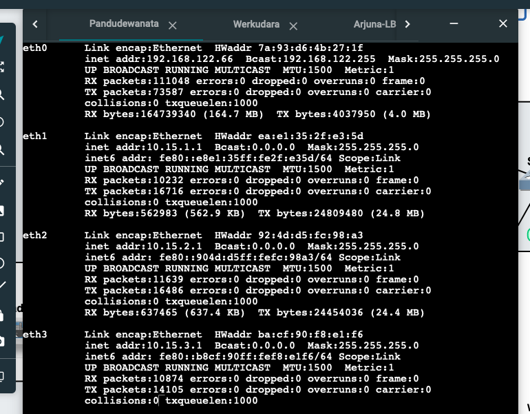
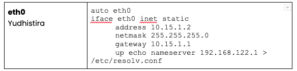
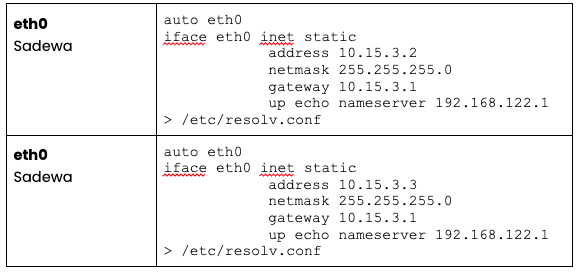
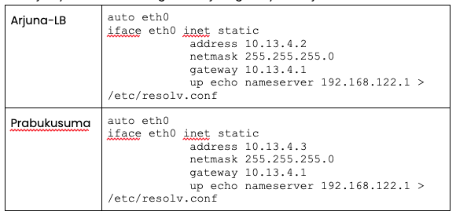

# Proof Of Concept Praktikum Jaringan Komputer Modul 2

- [Proof Of Concept Praktikum Jaringan Komputer Modul 2](#proof-of-concept-praktikum-jaringan-komputer-modul-2)
  - [Kelompok : B13](#kelompok--b13)
  - [Soal 1](#soal-1)
    - [Deskripsi](#deskripsi)
    - [Solusi](#solusi)
    - [Hasil](#hasil)
  - [Soal No 2](#soal-no-2)
    - [Deskripsi](#deskripsi-1)
    - [Solusi](#solusi-1)
    - [Hasil](#hasil-)
  - [Soal No 3](#soal-no-3)
    - [Deskripsi](#deskripsi-2)
    - [Solusi](#solusi-2)
    - [Hasil](#hasil-1)
  - [Soal No 4](#soal-no-4)
    - [Deskripsi](#deskripsi-3)
    - [Solusi](#solusi-3)
    - [Hasil](#hasil-2)
  - [Soal No 5](#soal-no-5)
    - [Deskripsi](#deskripsi-4)
    - [Solusi](#solusi-4)
  - [Soal No 6](#soal-no-6)
    - [Deskripsi](#deskripsi-)
    - [Solusi](#solusi-5)
    - [Hasil](#hasil-3)
  - [Soal No 7](#soal-no-7)
    - [Deskripsi](#deskripsi-5)
    - [Solusi](#solusi-6)
    - [Hasil](#hasil-4)
  - [Soal No 8](#soal-no-8)
    - [Deskripsi](#deskripsi-6)
    - [Solusi](#solusi-7)
    - [Hasil](#hasil-5)
  - [Soal No 9](#soal-no-9)
    - [Deskripsi](#deskripsi-7)
    - [Solusi](#solusi-8)
  - [Soal No 10](#soal-no-10)
    - [Deskripsi](#deskripsi-8)
    - [Solusi](#solusi-9)
    - [Hasil](#hasil-6)

## Kelompok : B13

| NRP        | Nama                 |
| ---------- | -------------------- |
| 5025211042 | Robby Ulung Pambudi  |
| 5025211151 | Tsaqif Deniar Bhakti |

# Soal 1

## Deskripsi

Yudhistira akan digunakan sebagai DNS Master, Werkudara sebagai DNS Slave, Arjuna merupakan Load Balancer yang terdiri dari beberapa Web Server yaitu Prabakusuma, Abimanyu, dan Wisanggeni. Buatlah topologi dengan pembagian [sebagai berikut.](https://docs.google.com/spreadsheets/d/1OqwQblR_mXurPI4gEGqUe7v0LSr1yJViGVEzpMEm2e8/edit?usp=sharing) Folder topologi dapat diakses pada [drive berikut](https://drive.google.com/drive/folders/1Ij9J1HdIW4yyPEoDqU1kAwTn_iIxg3gk?usp=sharing)&#x20;

## Solusi

Untuk membuat topologi tersebut pertama kita perlu setup gns sampai muncul tampilan sebagai berikut :


Kemudian kita buka alamat yang terterah di gns tersebut yaitu : http://172.16.175.129

Setelah terbuka pada browser langkah dan sambungkan masing - masing node sesuai dengan gambar pada soal


Sesuai nama pada topologi menjadi seperti berikut :


Kemudian Sesuaikan masing-masing IP pada node dengan prefix ip adalah `10.15.xxx.xxx`
dengan cara setting configuration pada router dengan script sebagai berikut :


Kemudian jika berhasil maka sebagai berikut



Kemudian setting node `Yudhistira (eth1 -> eth0)`



Kemudian setting node `Werkudara (eth2 -> eth0)`


Kemudian kita setting bagian pada **eth3** dan kita bagi ip antara sadewa dan nakula menjadi berikut :

**Sadewa** : `10.15.3.2`

**Nakula** : `10.15.3.3`

Selanjutnya kita buat configuration jaringan nya menjadi berikut :



Kemudian kita setting bagian pada **eth4** dan kita bagi ip antara Arjuna-LB, Prabukusuma, Abimanyu, dan Wissanggeni menjadi berikut :

**Arjuna-LB** : `10.15.4.2`

**Prabukusuma** : `10.15.4.3`

**Abimanyu** : `10.15.4.4`

**Wissanggeni** : `10.15.4.5`

Selanjutnya buat configuration jaringan nya menjadi berikut :




Kemudian setting iptable agar seluruh node di bawah router bisa terkoneksi ke internet dengan cara tulis syntax berikut pada Node **Yudhistira** :

```
iptables -t nat -A POSTROUTING -o eth0 -j MASQUERADE -s 10.15.0.0/16
```

Dan semua node pada project tersebut sudah terhubung dan terkoneksi dengan internet.

Langkah selanjutnya setting node **Yudhistira** menjadi DNS Master dan node **Werkudara**,
Langkah pertama kita perlu melakukan instalasi bind9 dengan cara sebagai berikut

```
apt-get update
apt-get install bind9 -y
service bind9 start
```

Yang selanjutnya konfigurasi akan dibahas di soal No 2.

Maka node **Yudhistira** dan **Werkudara** siap untuk dijadikan sebuah DNS Server.
Selanjutnya kita siapkan node **Arjuna-LB** sebagai load balancer dengan cara :

```
apt-get update
apt-get install nginx -y
service nginx start
```

## Hasil

Selesai configuration node sudah selesai dan siap untuk digunakan. kita bisa check keterhubungan dari node tersebut dengan cara melakukan ping ke masing-masing node dan mendapatkan hasil sebagai berikut :

# Soal No 2

## Deskripsi

Buatlah website utama dengan akses ke **arjuna.yyy.com** dengan alias **www\.arjuna.yyy.com** dengan yyy merupakan kode kelompok.

## Solusi

Untuk membuat DNS tersebut pertama-tama kita aktifkan dulu seluruh node dan kita langsung ke console dari node **Yudhistira** sebagai DNS Master pada jaringan ini.

gambar 2.1

Setelah `/etc/bind` sudah terbuka di node Yudhistira, langkah selanjutnya membuat sebuah folder yaitu **arjuna.b13** dan kemudian membuat sebuah konfigurasi sebagai berikut :

File : `/etc/bind/arjuna.b13`

```
;
; BIND data file for local loopback interface
;
$TTL	604800
@   	IN  	SOA 	b13.com. root.b13.com. (
                    	2023091001  	; Serial
                     	604800     	; Refresh
                      	86400     	; Retry
                    	2419200     	; Expire
                     	604800 )   	; Negative Cache TTL
;
@   	IN  	NS  	arjuna.b13.com.
@   	IN  	A   	10.15.4.2   	; IP Arjuna
@   	IN  	AAAA	::1
```

Dan kita tambahkan pada file : `/etc/bind/named.conf.local `

sebagai berikut :

```
zone "arjuna.b13.com" {
    	type master;
    	file "/etc/bind/arjuna.b13/arjuna.b13.com";
};
```

Kemudian kita ganti salah satu nameserver pada node **Sadewa** untuk melakukan testing DNS tersebut.

```
nameserver 10.15.1.2
```

dan lakukan test pada DNS tersebut dengan cara ping **arjuna.b13.com** dan didapatkan hasil sebagai berikut :

gambar 2.2

Untuk menambahkan alias www.arjuna.b13.com maka kita harus menambahkan alias pada `/etc/bind/arjuna.b13/arjuna.b13.com` sebagai berikut :

File : `/etc/bind/arjuna.b13/arjuna.b13.com`

```
;
; BIND data file for local loopback interface
;
$TTL	604800
@   	IN  	SOA 	b13.com. root.b13.com. (
                    	2023091001  	; Serial
                     	604800     	; Refresh
                      	86400     	; Retry
                    	2419200     	; Expire
                     	604800 )   	; Negative Cache TTL
;
@   	IN  	NS  	arjuna.b13.com.
@   	IN  	A   	10.15.4.2   	; IP Arjuna
www   IN   CNAME arjuna.b13.com.
@   	IN  	AAAA	::1
```

## Hasil

Sehingga apabila kita ping yang kedua kalinya akan menampilkan hasil sebagai berikut :

gambar 2.3

Yang artinya konfigurasi DNS kita sudah berhasil dan siap untuk digunakan.

# Soal No 3

## Deskripsi

Dengan cara yang sama seperti soal nomor 2, buatlah website utama dengan akses ke **abimanyu.yyy.com** dan alias **www.abimanyu.yyy.com.**

## Solusi

Sama seperti langkah langkah sebelumnya maka akan jadi sebuah configuration file seperti berikut :

File : `/etc/bind/abimanyu.b13/abimanyu.b13.com`

```
;
; BIND data file for local loopback interface
;
$TTL	604800
@   	IN  	SOA 	b13.com. root.b13.com. (
                    	2023091001  	; Serial
                     	604800     	; Refresh
                      	86400     	; Retry
                    	2419200     	; Expire
                     	604800 )   	; Negative Cache TTL
;
@   	IN  	NS  	abimanyu.b13.com.
@   	IN  	A   	10.15.4.4   	; IP Abimanyu
www   IN   CNAME abimanyu.b13.com.
@   	IN  	AAAA	::1
```

Dan kita tambahkan pada file : `/etc/bind/named.conf.local` sebagai berikut :

```

zone "arjuna.b13.com" {
    	type master;
    	file "/etc/bind/arjuna.b13/arjuna.b13.com";
};

zone "abimanyu.b13.com" {
    	type master;
    	file "/etc/bind/abimanyu.b13/abimanyu.b13.com";
};
```

## Hasil

Apabila kita coba ping lagi maka akan menampilkan respond seperti berikut :

gambar 3.1

# Soal No 4

## Deskripsi

Kemudian, karena terdapat beberapa web yang harus di-deploy, buatlah subdomain parikesit.abimanyu.yyy.com yang diatur DNS-nya di Yudhistira dan mengarah ke Abimanyu.

## Solusi

Untuk membuat sebuah subdomain maka yang perlu kita butuhkan adalah menambahkan sebuah identitas pada DNS Server (Node **Yudhisthira**), tambahan tersebut adalah :

```
;
; BIND data file for local loopback interface
;
$TTL	604800
@   	IN  	SOA 	b13.com. root.b13.com. (
                    	2023091001  	; Serial
                     	604800     	; Refresh
                      	86400     	; Retry
                    	2419200     	; Expire
                     	604800 )   	; Negative Cache TTL
;
@   	IN  	NS  	abimanyu.b13.com.
@   	IN  	A   	10.15.4.4   	; IP Abimanyu
www 	IN  	CNAME   abimanyu.b13.com.
parikesit IN	A   	10.15.4.4   	; IP Abimanyu
@   	IN  	AAAA	::1
```

## Hasil

Yang apabilah kita test dengan melakukan ping ke parikesit.abimanyu.b13.com yang hasilnya sebagai berikut :

Gambar 4.1

Bisa kita lihat ping diatas menghasilkan sebuah respond ip ..4.4 yaitu IP node Abimanyu, yang artinya sambungan tersebut sudah berhasil.

# Soal No 5

## Deskripsi

Buat juga reverse domain untuk domain utama.

## Solusi

Untuk membuat reverse domain tersebut kita bisa pergi ke file `/etc/bind/named.conf` dan menambahkan script sebagai berikut :

```
zone "4.13.10.in-addr.arpa" {
    	type master;
    	file "/etc/bind/4.13.10.in-addr/4.13.10.in-addr.arpa";
};
```

Save dan kita buat sebuah file sebagai tempat penampungan reverse domain dengan nama folder `4.13.10.in-addr` tambahkan pada file sesuai dengan file diatas yaitu :

gambar 5.1

Kemudian kita bisa restart dan check apakah konfigurasi diatas sudah benar dengan cara tulis command di bawah ini pada node **Sadewa**:

gambar 5.2

gambar 5.3

## Hasil

Dari hasil diatas kita bisa melihat bahwa masing masing ip sudah memberikan respond domain masing yang artinya settingan reverse domain sudah berhasil terpasang sempurna.

# Soal No 6

## Deskripsi

Agar dapat tetap dihubungi ketika DNS Server Yudhistira bermasalah, buat juga Werkudara sebagai DNS Slave untuk domain utama.

## Solusi

Untuk menambahkan DNS Slave pada server **Werkudara** kita perlu mengatur node pada Yudhistira untuk mengarahkan ke IP Yudhistira apabila terdapat kegagalan dengan cara edit `conf /etc/bind/named.conf.local` dengan menambahkan script sebagai berikut :

```
zone "arjuna.b13.com" {
    	type master;
    	notify yes;
    	also-notify { 10.15.2.2; } // IP Werkudara
    	allow-transfer { 10.15.2.2; } // IP Werkudara
    	file "/etc/bind/arjuna.b13/arjuna.b13.com";
};

zone "abimanyu.b13.com" {
    	type master;
    	also-notify { 10.15.2.2; } // IP Werkudara
    	alow-transfer { 10.15.2.2; } // IP Werkudara
    	file "/etc/bind/abimanyu.b13/abimanyu.b13.com";
};

zone "4.13.10.in-addr.arpa" {
    	type master;
    	file "/etc/bind/4.13.10.in-addr/4.13.10.in-addr.arpa";
};
```

Save dan restart bind9, kemudian setting node **Werkudara** pada file `/etc/bind/named.conf.local` menjadi sebagai berikut :

```
zone "arjuna.b13.com" {
    	type slave;
    	masters { 10.15.1.2; }; // IP Yudhistira
    	file "/var/lib/arjuna.b13.com";
};

zone "abimanyu.b13.com" {
    	type slave;
    	masters { 10.15.1.2; }; // IP Yudhistira
    	file "/var/lib/abimanyu.b13.com";
};
```

Kemudian restart bind9 pada node **Werkudara**, dan kita lakukan percobaan pada Node **Sadewa**, namun pertama-tama kita perlu menambahkan nameserver dari IP **Werkudara** sehingga akan tampil sebagai berikut :

File : `/etc/resolv.conf`

```
nameserver 10.15.2.2
nameserver 10.15.1.2
```

## Hasil

Setelah itu matikan bind dari server Yudhistira dan lakukan percobaan pada node Sadewa dengan cara ping arjuna.b13.com dan menampilkan hasil sebagai berikut:

Gambar 6.1

Dari hasil diatas kita bisa simpulkan bahwa dns slave sudah bekerja dengan baik.

# Soal No 7

## Deskripsi

Seperti yang kita tahu karena banyak sekali informasi yang harus diterima, buatlah subdomain khusus untuk perang yaitu **baratayuda.abimanyu.yyy.com** dengan alias **www.baratayuda.abimanyu.yyy.com** yang didelegasikan dari Yudhistira ke Werkudara dengan IP menuju ke Abimanyu dalam folder Baratayuda.

## Solusi

Untuk membuat subdomain tersebut kita bisa pergi ke server Yudhistira dan pergi ko directory `/etc/bind/abimanyu.b13` kemudian tambahkan script berikut :

```
;
; BIND data file for local loopback interface
;
$TTL     604800
@   	IN  	SOA 	b13.com. root.b13.com. (
                    	2023091001  	; Serial
                     	604800     	; Refresh
                      86400     	      ; Retry
                    	2419200     	; Expire
                     	604800 )   	; Negative Cache TTL
;
@           	IN  	NS  	abimanyu.b13.com.
@           	IN  	A   	10.15.4.4   	; IP Abimanyu
www         	IN  	CNAME   abimanyu.b13.com.
parikesit   	IN  	A   	10.15.4.4   	; IP Abimanyu
ns1         	IN  	A   	10.15.2.2   	; IP Werkudara
baratayuda  	IN  	NS  	ns1
@   	IN  	AAAA	::1
```

File diatas bertugas untuk mendelegasikan ke IP **Werkudara** save dan edit file pada folder `/etc/bind/named.conf.options` Kemudian comment dnssec-validation auto; dan tambahkan baris berikut pada `/etc/bind/named.conf.options`

```
allow-query{any;};
```

Langkah selanjutnya adalah restart server dan atur kembali configuration pada Node **Werkudara** dengan cara ubah named.conf.local menjadi seperti berikut :

```
zone "arjuna.b13.com" {
    	type slave;
    	masters { 10.15.1.2; }; // IP Yudhistira
    	file "/var/lib/arjuna.b13.com";
};

zone "abimanyu.b13.com" {
    	type slave;
    	masters { 10.15.1.2; }; // IP Yudhistira
    	file "/var/lib/abimanyu.b13.com";
};

zone "baratayuda.abimanyu.b13.com" {
    	type master;
    	file "/etc/bind/baratayuda/baratayuda.abimanyu.b13.com";
};

```

Setelah itu kita bisa bikin sebuah folder pada **/etc/bind/** dengan nama folder delegasi dan kita bikin sebuah file dengan nama **baratayuda.abimanyu.b13.com** yang selanjutnya berisikan konfigurasi sebagai berikut :

```
;
; BIND data file for local loopback interface
;
$TTL	604800
@   	IN  	SOA 	abimanyu.b13.com. root.abimanyu.b13.com. (
                    	2023101001  	; Serial
                     	604800     	; Refresh
                      	86400     	; Retry
                    	2419200     	; Expire
                     	604800 )   	; Negative Cache TTL
;
@   	IN  	NS  	baratayuda.abimanyu.b13.com.
@   	IN  	A   	10.15.4.4   	; IP Abimanyu
www 	IN  	CNAME   baratayuda.abimanyu.b13.com.
```

Setelah itu kita bisa lakukan uji coba dengan melakukan ping pada domain tersebut dari Node Sadewa dan mendapatkan hasil sebagai berikut :

gambar 7.1

Dan selesai dari kedua ping diatas mendapatkan respond dan tidak ada yang gagal artinya soal ini berhasil terjawab.

# Soal 8

## Deskripsi

Untuk informasi yang lebih spesifik mengenai Ranjapan Baratayuda, buatlah subdomain melalui Werkudara dengan akses rjp.baratayuda.abimanyu.yyy.com dengan alias www.rjp.baratayuda.abimanyu.yyy.com yang mengarah ke Abimanyu.

## Solusi

Untuk menambahkan subdomain itu kita hanya tinggal merubah /etc/bind/delegasi/baratayuda.abimanyu.b13.com dan menabhakan subdomainya beserta cnamnya sehingga kurang lebih syntax yang baru akan berbentuk seperti berikut ini :

```
@   	IN  	SOA 	abimanyu.b13.com. root.abimanyu.b13.com. (
                    	2023101001  	; Serial
                     	604800     	; Refresh
                      	86400     	; Retry
                    	2419200     	; Expire
                     	604800 )   	; Negative Cache TTL
;
@   	IN  	NS  	baratayuda.abimanyu.b13.com.
@   	IN  	A   	10.15.4.4   	; IP Abimanyu
www 	IN  	CNAME   baratayuda.abimanyu.b13.com.
rjp 	IN  	A   	10.15.4.4   	; IP Abimanyu
www.rjp IN  	CNAME   rjp.baratayuda.abimanyu.b13.com.
```

dan kita lakukan testing dengan cara ping rjp.baratayuda.abimanyu.b13.com dan juga www.rjp sehingga mendapatkan hasil sebagai berikut :

Gambar 8.1

# Soal 9

## Deskripsi

Arjuna merupakan suatu Load Balancer Nginx dengan tiga worker (yang juga menggunakan nginx sebagai web server) yaitu Prabakusuma, Abimanyu, dan Wisanggeni. Lakukan deployment pada masing-masing worker.

## Solusi

Step pertama lakukan instalasi nginx pada ke-4 node tersebut dengan cara :

```
apt-get update
apt-get install nginx -y
service nginx start
```

Kemudian kita juga harus melakukan instalasi lynx untuk melakukan check apakah deployment sudah berhasil atau belum, dengan cara

```
apt-get install lynx
```

Kita bisa check apakah deployment sudah berhasil atau belum dengan cara

```
lynx localhost
```

Dan mendapatkan hasil sebagai berikut untuk ke tiga node tersebut

Gambar 9.1

yang artinya proses deployment web server sudah berhasil dilakukan.

# Soal 10

## Deskripsi

Kemudian gunakan algoritma Round Robin untuk Load Balancer pada Arjuna. Gunakan server_name pada soal nomor 1. Untuk melakukan pengecekan akses alamat web tersebut kemudian pastikan worker yang digunakan untuk menangani permintaan akan berganti ganti secara acak. Untuk webserver di masing-masing worker wajib berjalan di port 8001-8003. Contoh - Prabakusuma:8001 - Abimanyu:8002 - Wisanggeni:8003

## Solusi

Untuk melakukan setting nginx menggunakan algoritma Round Robin pertama kita bisa akses ke Server Arjuna kemudian masuk /etc/nginx/sites-available dan membuat sebuah file yang bernama arjuna.b13.com yang berisikan syntax berikut :
file : /etc/nginx/sites-available

```
# Default menggunakan Round Robin
upstream arjuna  {
    	server 10.15.4.3:8001 ; #IP Prabukusuma
    	server 10.15.4.4:8002 ; #IP Abimanyu
    	server 10.15.4.5:8003 ; #IP Wissanggeni
}

 server {
    	listen 80;
    	server_name arjuna.b13.com;

    	location / {
            	proxy_pass http://arjuna;
    	}
}
```

Kemudian buat sebuah symlink ke :

```
 ln -s /etc/nginx/sites-available/arjuna.b13.com /etc/nginx/sites-enabled
```

Selanjutnya kita akan check apakah configuration kita sudah benar atau belum dengan cara tulis nginx -t dan hasil nya sebagai berikut :

```
nginx: the configuration file /etc/nginx/nginx.conf syntax is ok
nginx: configuration file /etc/nginx/nginx.conf test is successful
```

Selanjutnya kita akan restart nginx dan setup 3 Server dibawahnya yaitu Prabukusuma, Abimanyu, dan Wissanggeni sebelum itu kita install dulu tool seperti php dan php-fpm untuk menjalankan php dengan cara :

```
apt-get install php php-fpm -y
service php7.0-fpm start
```

agar nginx bisa berjalan pada port yang sudah ditentukan, untuk melakukan hal tersebut kita bisa buka 3 server diatas dan membuat sebuah file nginx sebagai berikut :

```
server {
    	listen 8001;
    	root /var/www/arjuna.b13.com;
    	index index.php index.html index.htm;
    	server_name arjuna.b13.com;
    	location / {
            	try_files $uri /index.php?$query_string;
    	}
    	location ~ \.php$ {
            	include snippets/fastcgi-php.conf;
            	fastcgi_pass unix:/var/run/php/php7.0-fpm.sock;
    	}
    	location ~ /\.ht {
            	deny all;
    	}
    	error_log /var/log/nginx/arjuna.b13.error.log;
    	access_log /var/log/nginx/arjuna.b13.access.log;
}
```

kemudian disesuaikan listen sesuai dengan port pada soal, selanjutnya restart nginx dan check apakah sudah berhasil atau belum dengan lynx localhost dan mendapatkan hasil seperti berikut :

gambar 10.1

gambar 10.2

gambar 10.3

# Soal 11

## Deskripsi

Selain menggunakan Nginx, lakukan konfigurasi Apache Web Server pada worker Abimanyu dengan web server www.abimanyu.yyy.com. Pertama dibutuhkan web server dengan DocumentRoot pada /var/www/abimanyu.yyy

## Solusi

Untuk melakukan hal tersebut pertama kita harus install dulu pada worker Abimanyu sebuah apache dengan cara

```
apt-get install apache2
```

Selanjutnya kita download unzip dan wget untuk download resources yang sudah disediakan dan kemudian kita bikin sebuah folder di /var/www/abimanyu.b13 dan pindah hasil download ke folder tersebut.

Setelah selesai kita perlu setting documentroot pada webserver ini untuk mengarah ke /var/www/abimanyu.b13 pertama-tama masuk ke directory cd /etc/apache2/sites-available dan edit file 000-default.conf dan tambahkan script berikut

```
ServerName www.abimanyu.b13.com
DocumentRoot /var/www/abimanyu.b13
```

Setelah selesai kita coba restart apache2 nya dan kita coba testing dengan cara lynx arjuna.b13.com/home.html di server abimanyu tersebut

Gambar 11.1

# Soal 12

## Deskripsi

Setelah itu ubahlah agar url www.abimanyu.yyy.com/index.php/home menjadi www.abimanyu.yyy.com/home.

## Solusi

Untuk merubah tersebut tambahkan syntax berikut pada /etc/apache2/sites-available/arjuna.b13.com.conf

```
<Directory /var/www/abimanyu.b13>
      Options +Indexes
</Directory>

Alias "/home" "/var/www/abimanyu.b13/index.php/home"
```

Setelah itu restart server apache2 dan lakukan ujicoba pada server sadewa, dan tampil hasil sebagai berikut :

Gambar 12.1

# Soal 13

## Deskripsi

Selain itu, pada subdomain www.parikesit.abimanyu.yyy.com, DocumentRoot disimpan pada /var/www/parikesit.abimanyu.yyy

## Solusi

Pertama download resource yang diperlukan, kemudian tambahan sebuah syntax berikut pada /etc/apache2/sites-available

```
<VirtualHost *:80>

    	ServerName parikesit.abimanyu.b13.com

    	ServerAdmin webmaster@localhost
    	DocumentRoot /var/www/parikesit.abimanyu.b13.com
    	ServerAlias www.parikesit.abimanyu.b13.com

    	ErrorLog ${APACHE_LOG_DIR}/error.log
    	CustomLog ${APACHE_LOG_DIR}/access.log combined

</VirtualHost>
```

# Soal 13

## Deskripsi

Pada subdomain tersebut folder /public hanya dapat melakukan directory listing sedangkan pada folder /secret tidak dapat diakses (403 Forbidden).

## Solusi

Untuk membuat folder public yang bisa di listing directory dan folder secret yang forbidden kita menambahkan sebuah syntex di script sebelumnya yaitu

```
<VirtualHost *:80>
    	ServerName parikesit.abimanyu.b13.com

    	ServerAdmin webmaster@localhost
    	DocumentRoot /var/www/parikesit.abimanyu.b13.com
    	ServerAlias www.parikesit.abimanyu.b13.com

    	# Soal No 14
    	<Directory /var/www/abimanyu.b13.com/public>
            	Options +Indexes
    	</Directory>

    	<Directory /var/www/parikesit.abimanyu.b13.com/secret>
            	Options -Indexes
    	</Directory>

    	ErrorLog ${APACHE_LOG_DIR}/parikesit_error.log
    	CustomLog ${APACHE_LOG_DIR}/parikesit_access.log combined

</VirtualHost>
```

Gambar 14.1

# Soal 15

## Deskripsi

Buatlah kustomisasi halaman error pada folder /error untuk mengganti error kode pada Apache. Error kode yang perlu diganti adalah 404 Not Found dan 403 Forbidden.

## Solusi

Untuk melakukan kustomisasi error tersebut yang perlu dilakukan adalah menambahkan syntax berikut pada

```
ErrorDocument 404 /error/404.html
ErrorDocument 403 /error/403.html
```

Sehingga apabila kita uji coba maka akan menghasilkan sebagai berikut :

Gambar 15.1

Gambar 15.2

# Soal 16

## Deskripsi

Buatlah suatu konfigurasi virtual host agar file asset www.parikesit.abimanyu.yyy.com/public/js menjadi
www.parikesit.abimanyu.yyy.com/js

## Solusi

Untuk menyelesaikan tersebut kita membuat sebuah alias untuk menyingkat public/js menjadi js dengan cara tambahkan script berikut :

```
Alias "/js" "/var/www/parikesit.abimanyu.b13.com/public/js"

```

Kemudian kita lakukan test dengan cara lynx parikesit.abimanyu.b13.com/js maka akan mendapatkan hasil sebabgai berikut:

Gambar 16.1

# Soal 17

## Deskripsi

Agar aman, buatlah konfigurasi agar www.rjp.baratayuda.abimanyu.yyy.com hanya dapat diakses melalui port 14000 dan 14400.

## Solusi

Pastikan semua resource sudah terdownload dan pindah ke /var/www/rjp.baratayuda.abimanyu.b13.com

```
<VirtualHost *:14000 *:14400 >
    	ServerName rjp.baratayuda.abimanyu.b13.com

    	ServerAdmin webmaster@localhost
    	DocumentRoot /var/www/rjp.baratayuda.abimanyu.b13.com
	ServerAlias www.rjp.baratayuda.abimanyu.b13.com

    	ErrorLog ${APACHE_LOG_DIR}/parikesit_error.log
    	CustomLog ${APACHE_LOG_DIR}/parikesit_access.log combined

</VirtualHost>
```

Kemudian tambahkan listen 14000 dan 14400 pada /etc/apache2/ports.conf

```
Listen 14000
Listen 14400
```

Selanjutnya restart apache dan check apakah server abimanyu sudah membuka port 14400 dan 14000 dengan cara netsat -nltp | grep apache

Gambar 17.1

Kemudian kita check di client apakah sudah bisa diakses atau belum:

Gambar 17.2

Gambar 17.3

# Soal 18

## Deskripsi

Untuk mengaksesnya buatlah autentikasi username berupa “Wayang” dan password “baratayudayyy” dengan yyy merupakan kode kelompok. Letakkan DocumentRoot pada /var/www/rjp.baratayuda.abimanyu.yyy.

## Solusi

Pertama kita install tool berikut ini :

```
sudo apt-get update
sudo apt-get install apache2 apache2-utils
```

Setelah itu kita bisa membuat password dengan cara

```
sudo htpasswd -c /etc/apache2/.htpasswd Wayang

```

Kemudian masukan password yaitu baratayudab13
Kemudian kita tambahkan script di sites-available/rjp.baratayuda dengan

Gambar 18.1

kemudian diisikan passwordnya dan usernamenya yaitu : Wayang dan baratayudab13 maka akan keluar tampilan seperti berikut:

Gambar 18.2

# Soal 19

## Deskripsi

Buatlah agar setiap kali mengakses IP dari Abimanyu akan secara otomatis dialihkan ke www.abimanyu.yyy.com (alias)

## Solusi

Untuk menyelesaikan problem diatas sebenernya kita tinggal ubah httaccess untuk memforward ke domain tersebut, tapi sebelum itu kita pastikan dulu a2enmod rewrite sudah menyalah dengan cara menjalankan

```
a2enmod rewrite

```

Setelah itu kita setting .htaccess menjadi sebagai berikut sebagai berikut :

```
RewriteEngine On
RewriteBase /
RewriteCond %{HTTP_HOST} ^10\.13\.4\.4$
RewriteRule ^(.*) http://www.abimanyu.b13.com/$1 [L,R=301]
```

# Soal 20

## Deskripsi

Karena website www.parikesit.abimanyu.yyy.com semakin banyak pengunjung dan banyak gambar gambar random, maka ubahlah request gambar yang memiliki substring “abimanyu” akan diarahkan menuju abimanyu.png.

## Solusi

Pertama tama pasang .htaccess pada /var/www/parikesit.abimanyu.b13.com kemudian tambahakan syntax dibawah ini

```
RewriteEngine On
RewriteBase /

# Redirect requests for images containing "abimanyu" to abimanyu.png
RewriteCond %{REQUEST_URI} abimanyu [NC]
RewriteRule \.(jpg|jpeg|png|gif)$ http://www.parikesit.abimanyu.b13.com/abimanyu.png [L,R=301]
```

Kemudian Tambahkan alias dengan cara ubah parikesit.abimanyu.b13.com.conf menjadi
